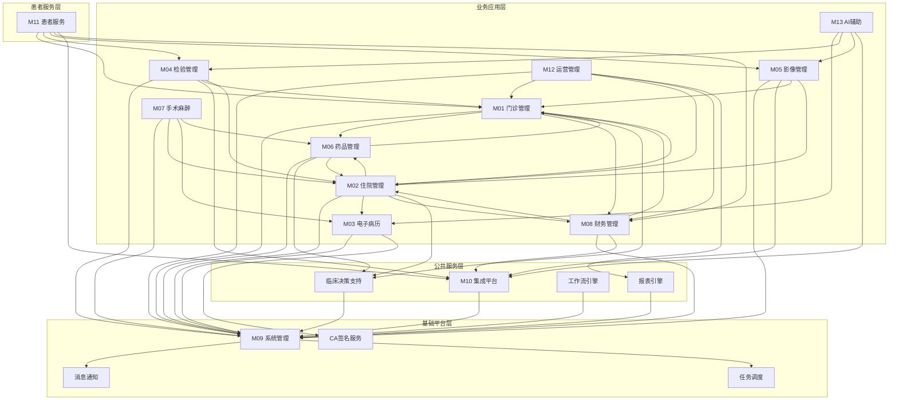

# YUDAO-AI-HIS 智慧医疗信息系统 - 模块划分文档

> **文档编号**: YUDAO-HIS-MDD-001
> **版本**: V1.0
> **创建日期**: 2026-06-16
> **状态**: 评审中
> **编制方法**: 基于PRD文档和业务规则文档，按照业务领域划分原则设计模块架构
> **参考标准**: HIMSS EMRAM Stage 5+ | HL7 FHIR R4 | 微服务架构设计原则

---

## 1. 模块划分概述

### 1.1 划分原则

| 原则 | 说明 |
|------|------|
| 业务领域划分 | 按门诊、住院、药品、检验、影像等医疗业务领域划分，边界清晰 |
| 高内聚低耦合 | 同一业务领域功能聚合，模块间通过标准接口交互 |
| 微服务演进 | 模块设计支持未来微服务架构拆分，每个模块可独立部署 |
| 标准合规 | 符合HIMSS EMRAM Stage 5+、HL7 FHIR R4等国际标准 |
| 渐进式开发 | 按P0/P1/P2优先级分阶段开发，MVP先行 |

### 1.2 模块总数

| 统计项 | 数量 |
|--------|------|
| 子系统模块 | 13个 |
| 子模块 | 56个 |
| 功能点 | 约320个 |

---

## 2. 模块分层架构

### 2.1 架构分层图

```
┌─────────────────────────────────────────────────────────────────────────────┐
│                           患者服务层 (Patient Service Layer)                  │
│  ┌─────────────────────────────────────────────────────────────────────────┐ │
│  │  M11 患者服务子系统: 患者门户 | 预约挂号 | 报告查询 | 在线缴费 | 健康档案   │ │
│  └─────────────────────────────────────────────────────────────────────────┘ │
├─────────────────────────────────────────────────────────────────────────────┤
│                           业务应用层 (Business Application Layer)             │
│  ┌───────┐ ┌───────┐ ┌───────┐ ┌───────┐ ┌───────┐ ┌───────┐ ┌───────┐     │
│  │ M01   │ │ M02   │ │ M03   │ │ M04   │ │ M05   │ │ M06   │ │ M07   │     │
│  │门诊管理│ │住院管理│ │电子病历│ │检验LIS│ │影像RIS│ │药品管理│ │手术麻醉│     │
│  └───────┘ └───────┘ └───────┘ └───────┘ └───────┘ └───────┘ └───────┘     │
│  ┌───────┐ ┌───────┐ ┌───────┐                                             │
│  │ M08   │ │ M12   │ │ M13   │                                             │
│  │财务管理│ │运营管理│ │AI辅助 │                                             │
│  └───────┘ └───────┘ └───────┘                                             │
├─────────────────────────────────────────────────────────────────────────────┤
│                           公共服务层 (Common Service Layer)                   │
│  ┌─────────────────────────────────────────────────────────────────────────┐ │
│  │  M10 集成平台子系统: EMPI(患者主索引) | 主数据管理 | 消息引擎 | 接口适配器 │ │
│  └─────────────────────────────────────────────────────────────────────────┘ │
│  ┌───────────────────┐ ┌───────────────────┐ ┌───────────────────┐         │
│  │ 临床决策支持(CDS) │ │ 工作流引擎       │ │ 报表引擎         │         │
│  └───────────────────┘ └───────────────────┘ └───────────────────┘         │
├─────────────────────────────────────────────────────────────────────────────┤
│                           基础平台层 (Platform Layer)                        │
│  ┌─────────────────────────────────────────────────────────────────────────┐ │
│  │  M09 系统管理子系统: 用户权限(RBAC) | 数据字典 | 日志审计 | 系统配置      │ │
│  └─────────────────────────────────────────────────────────────────────────┘ │
│  ┌───────────────────┐ ┌───────────────────┐ ┌───────────────────┐         │
│  │ CA电子签名服务    │ │ 消息通知服务     │ │ 任务调度服务     │         │
│  └───────────────────┘ └───────────────────┘ └───────────────────┘         │
├─────────────────────────────────────────────────────────────────────────────┤
│                           基础设施层 (Infrastructure Layer)                   │
│  ┌─────────────────────────────────────────────────────────────────────────┐ │
│  │  Spring Boot 3.x | MySQL 8.x | Redis 7.x | RabbitMQ | MinIO | K8s       │ │
│  └─────────────────────────────────────────────────────────────────────────┘ │
└─────────────────────────────────────────────────────────────────────────────┘
```

### 2.2 分层职责说明

| 层级 | 职责 | 模块 |
|------|------|------|
| 患者服务层 | 患者自助服务入口，面向患者用户 | M11 |
| 业务应用层 | 核心医疗业务功能，面向医护/管理用户 | M01-M08, M12, M13 |
| 公共服务层 | 跨模块共享服务，支撑业务集成 | M10, CDS, 工作流, 报表 |
| 基础平台层 | 系统基础能力，安全认证/配置管理 | M09, CA签名, 消息, 任务 |
| 基础设施层 | 技术底座，运行环境/数据存储 | Spring Boot, MySQL, Redis等 |

---

## 3. 模块依赖关系图

### 3.1 Mermaid依赖图



### 3.2 依赖矩阵

| 模块 | 上游依赖(被依赖) | 下游依赖(依赖方) |
|------|------------------|------------------|
| M09 系统管理 | M01, M02, M03, M04, M05, M06, M07, M08, M10, M11, M12 | 无 |
| M10 集成平台 | M04, M05, M08, M11, M13 | M09 |
| M01 门诊管理 | M02, M11 | M09, M06, M08, CDS |
| M02 住院管理 | M07, M12 | M09, M01, M03, M06, M08, CDS |
| M03 电子病历 | M07, M13 | M09, CA |
| M04 检验管理 | M11, M13 | M09, M01, M02, M10 |
| M05 影像管理 | M11, M13 | M09, M01, M02, M10 |
| M06 药品管理 | M01, M02, M07 | M09, CDS |
| M07 手术麻醉 | 无 | M02, M03, M06, M09 |
| M08 财务管理 | M12 | M01, M02, M09, M10 |
| M11 患者服务 | 无 | M01, M04, M05, M08, M10 |
| M12 运营管理 | 无 | M01, M02, M08, M09, REPORT |
| M13 AI辅助 | 无 | M03, M04, M05, M10 |

---

## 4. 模块详细定义

### 4.1 M09 系统管理子系统

| 属性 | 内容 |
|------|------|
| 模块编号 | M09 |
| 模块名称 | 系统管理子系统 |
| 优先级 | P0 - MVP核心 |
| 预估工作量 | 3人月 |

#### 4.1.1 业务边界定义

系统管理子系统是整个HIS系统的基础底座，提供用户认证、权限控制、数据字典、系统配置等核心能力，支撑所有业务模块运行。

**边界范围**:
- 用户账号生命周期管理
- RBAC三级权限控制（菜单/按钮/数据）
- 数据字典统一管理
- 系统参数配置
- 审计日志记录与查询
- 组织机构管理

**边界排除**:
- 业务模块专属配置（如药品配置归属M06）
- CA电子签名（归属CA签名服务）

#### 4.1.2 功能清单

| 子模块编号 | 子模块名称 | 功能点编号 | 功能点名称 | 优先级 |
|------------|------------|------------|------------|--------|
| M09-01 | 用户管理 | F-SYS-001-01 | 用户创建 | P0 |
| | | F-SYS-001-02 | 用户修改 | P0 |
| | | F-SYS-001-03 | 用户删除 | P0 |
| | | F-SYS-001-04 | 用户查询 | P0 |
| | | F-SYS-001-05 | 密码重置 | P0 |
| | | F-SYS-001-06 | 用户锁定/解锁 | P0 |
| M09-02 | 角色管理 | F-SYS-002-01 | 角色创建 | P0 |
| | | F-SYS-002-02 | 角色权限配置 | P0 |
| | | F-SYS-002-03 | 角色分配用户 | P0 |
| | | F-SYS-002-04 | 数据权限配置 | P0 |
| M09-03 | 菜单管理 | F-SYS-003-01 | 菜单创建 | P0 |
| | | F-SYS-003-02 | 菜单权限绑定 | P0 |
| | | F-SYS-003-03 | 菜单排序 | P1 |
| M09-04 | 数据字典 | F-SYS-004-01 | 字典类型管理 | P0 |
| | | F-SYS-004-02 | 字典项管理 | P0 |
| | | F-SYS-004-03 | 字典版本历史 | P1 |
| | | F-SYS-004-04 | ICD-10诊断编码 | P0 |
| | | F-SYS-004-05 | 科室字典 | P0 |
| | | F-SYS-004-06 | 医保目录对照 | P1 |
| M09-05 | 组织机构 | F-SYS-005-01 | 医院信息配置 | P0 |
| | | F-SYS-005-02 | 科室管理 | P0 |
| | | F-SYS-005-03 | 病区管理 | P0 |
| | | F-SYS-005-04 | 床位管理 | P0 |
| M09-06 | 审计日志 | F-SYS-006-01 | 操作日志记录 | P0 |
| | | F-SYS-006-02 | 日志查询 | P0 |
| | | F-SYS-006-03 | 登录日志 | P0 |
| | | F-SYS-006-04 | 异常操作告警 | P1 |
| M09-07 | 系统配置 | F-SYS-007-01 | 参数配置 | P0 |
| | | F-SYS-007-02 | 定时任务管理 | P1 |

#### 4.1.3 依赖关系

| 关系类型 | 模块 | 说明 |
|----------|------|------|
| 上游依赖 | 无 | 基础模块，不依赖其他业务模块 |
| 下游依赖 | M01, M02, M03, M04, M05, M06, M07, M08, M10, M11, M12 | 所有业务模块依赖用户/权限/字典 |

#### 4.1.4 数据边界

| 数据类型 | 表名 | 边界属性 |
|----------|------|----------|
| 模块私有 | sys_user | 用户账号表 |
| 模块私有 | sys_role | 角色表 |
| 模块私有 | sys_permission | 权限表 |
| 模块私有 | sys_menu | 菜单表 |
| 模块私有 | sys_dict_type | 字典类型表 |
| 模块私有 | sys_dict_data | 字典数据表 |
| 模块私有 | sys_org | 组织机构表 |
| 模块私有 | sys_dept | 科室表 |
| 模块私有 | sys_audit_log | 审计日志表 |
| 模块私有 | sys_config | 系统配置表 |
| 共享数据 | sys_dict_data | 全院共享字典（诊断编码、科室等） |

#### 4.1.5 接口边界

| 接口编号 | 接口名称 | 接口类型 | 说明 |
|----------|----------|----------|------|
| API-SYS-001 | 用户登录认证 | REST | POST /api/auth/login |
| API-SYS-002 | 用户信息查询 | REST | GET /api/user/{id} |
| API-SYS-003 | 权限校验 | REST | POST /api/auth/check |
| API-SYS-004 | 字典查询 | REST | GET /api/dict/{type} |
| API-SYS-005 | 科室列表 | REST | GET /api/dept/list |
| API-SYS-006 | 审计日志写入 | 内部调用 | auditService.log() |

---

### 4.2 M01 门诊管理子系统

| 属性 | 内容 |
|------|------|
| 模块编号 | M01 |
| 模块名称 | 门诊管理子系统 |
| 优先级 | P0 - MVP核心 |
| 预估工作量 | 8人月 |
| RICE评分 | 178 |

#### 4.2.1 业务边界定义

门诊管理子系统覆盖门诊全流程：挂号→候诊→接诊→开方→收费→取药，支持日均5000+门诊量。

**边界范围**:
- 现场挂号、预约挂号、自助挂号、急诊挂号
- 门诊医生工作站（接诊、开方、诊断、病历）
- 门诊收费（费用汇总、医保结算、退费）
- 门诊药房（处方接收、审核、调配、发药）
- 门诊输液管理

**边界排除**:
- 门诊病历归档（归属M03电子病历）
- 门诊检验/影像申请执行（归属M04/M05）
- 药品库存管理（归属M06药品管理）

#### 4.2.2 功能清单

| 子模块编号 | 子模块名称 | 功能点编号 | 功能点名称 | 优先级 |
|------------|------------|------------|------------|--------|
| M01-01 | 挂号管理 | F-OP-001-01 | 现场挂号 | P0 |
| | | F-OP-001-02 | 预约挂号 | P0 |
| | | F-OP-001-03 | 自助机挂号 | P1 |
| | | F-OP-001-04 | 急诊挂号(分级分诊) | P0 |
| | | F-OP-001-05 | 退号管理 | P0 |
| | | F-OP-001-06 | 号源管理 | P0 |
| | | F-OP-001-07 | 候诊队列管理 | P0 |
| | | F-OP-001-08 | 医保身份验证 | P0 |
| M01-02 | 门诊医生工作站 | F-OP-002-01 | 接诊管理 | P0 |
| | | F-OP-002-02 | 诊断录入(ICD-10) | P0 |
| | | F-OP-002-03 | 处方开立 | P0 |
| | | F-OP-002-04 | 处方模板 | P1 |
| | | F-OP-002-05 | CDS校验触发 | P0 |
| | | F-OP-002-06 | 检验申请 | P0 |
| | | F-OP-002-07 | 影像申请 | P0 |
| | | F-OP-002-08 | 门诊病历书写 | P0 |
| | | F-OP-002-09 | 历史病历查询 | P1 |
| | | F-OP-002-10 | 就诊结束确认 | P0 |
| M01-03 | 门诊收费管理 | F-OP-003-01 | 费用自动汇总 | P0 |
| | | F-OP-003-02 | 收费结算 | P0 |
| | | F-OP-003-03 | 医保实时结算 | P0 |
| | | F-OP-003-04 | 退费管理 | P0 |
| | | F-OP-003-05 | 日结对账 | P0 |
| | | F-OP-003-06 | 收费统计报表 | P1 |
| M01-04 | 门诊药房管理 | F-OP-004-01 | 处方接收 | P0 |
| | | F-OP-004-02 | 处方审核 | P0 |
| | | F-OP-004-03 | 药品调配 | P0 |
| | | F-OP-004-04 | 发药确认 | P0 |
| | | F-OP-004-05 | 发药身份核对 | P0 |
| | | F-OP-004-06 | 退药管理 | P1 |
| M01-05 | 门诊输液管理 | F-OP-005-01 | 输液排位 | P1 |
| | | F-OP-005-02 | 输液执行 | P1 |
| | | F-OP-005-03 | 输液观察记录 | P1 |

#### 4.2.3 依赖关系

| 关系类型 | 模块 | 说明 |
|----------|------|------|
| 上游依赖 | M02住院管理(门诊转住院) | 入院管理调用挂号信息 |
| 上游依赖 | M11患者服务 | 患者预约挂号入口 |
| 下游依赖 | M09系统管理 | 用户/权限/字典/科室 |
| 下游依赖 | M06药品管理 | 处方审核/药品库存 |
| 下游依赖 | M08财务管理 | 收费结算 |
| 下游依赖 | CDS | 处方开立CDS校验 |

#### 4.2.4 数据边界

| 数据类型 | 表名 | 边界属性 |
|----------|------|----------|
| 模块私有 | his_registration | 挂号记录表 |
| 模块私有 | his_appointment | 预约挂号表 |
| 模块私有 | his_visit | 门诊就诊记录表 |
| 模块私有 | his_prescription | 门诊处方表 |
| 模块私有 | his_prescription_item | 处方明细表 |
| 模块私有 | his_charge | 门诊收费记录表 |
| 模块私有 | his_charge_item | 收费明细表 |
| 模块私有 | his_refund | 退费记录表 |
| 共享数据 | his_patient | 患者主索引(EMPI管理) |
| 共享数据 | his_diagnosis | 诊断记录(电子病历共享) |

#### 4.2.5 接口边界

| 接口编号 | 接口名称 | 接口类型 | 说明 |
|----------|----------|----------|------|
| API-OP-001 | 挂号创建 | REST | POST /api/outpatient/registration |
| API-OP-002 | 挂号查询 | REST | GET /api/outpatient/registration/{id} |
| API-OP-003 | 就诊记录创建 | REST | POST /api/outpatient/visit |
| API-OP-004 | 处方开立 | REST | POST /api/outpatient/prescription |
| API-OP-005 | 处方提交审核 | 消息 | 发送至M06药房 |
| API-OP-006 | 收费结算 | REST | POST /api/outpatient/charge |
| API-OP-007 | 医保结算调用 | 外部接口 | IF-001医保接口 |
| API-OP-008 | 号源查询 | REST | GET /api/outpatient/schedule |
| IF-OP-M01-M02 | 门诊转住院 | 内部调用 | 入院管理读取门诊诊断 |
| IF-OP-M01-M04 | 检验申请 | 消息 | 发送检验申请至LIS |
| IF-OP-M01-M05 | 影像申请 | 消息 | 发送检查申请至RIS |

---

### 4.3 M02 住院管理子系统

| 属性 | 内容 |
|------|------|
| 模块编号 | M02 |
| 模块名称 | 住院管理子系统 |
| 优先级 | P0 - MVP核心 |
| 预估工作量 | 10人月 |
| RICE评分 | 143 |

#### 4.3.1 业务边界定义

住院管理子系统覆盖住院全流程：入院→医嘱管理→护理执行→出院结算，是闭环给药（HIMSS EMRAM Stage 5）的核心模块。

**边界范围**:
- 入院登记、床位分配、预交金管理
- 住院医生工作站（医嘱开立、诊断管理、病历书写）
- 护理工作站（医嘱执行、护理记录、eMAR给药、交接班）
- 床位管理（床位图、床位状态）
- 出院管理（出院申请、出院结算、出院带药）

**边界排除**:
- 住院病历归档（归属M03电子病历）
- 手术排期管理（归属M07手术麻醉）
- 住院费用明细记账（归属M08财务管理）

#### 4.3.2 功能清单

| 子模块编号 | 子模块名称 | 功能点编号 | 功能点名称 | 优先级 |
|------------|------------|------------|------------|--------|
| M02-01 | 入院管理 | F-IP-001-01 | 入院登记 | P0 |
| | | F-IP-001-02 | 床位分配 | P0 |
| | | F-IP-001-03 | 预交金管理 | P0 |
| | | F-IP-001-04 | 医保登记 | P0 |
| | | F-IP-001-05 | 入院评估(跌倒/压疮) | P0 |
| | | F-IP-001-06 | 入院诊断关联 | P0 |
| M02-02 | 住院医生工作站 | F-IP-002-01 | 医嘱开立(长期/临时) | P0 |
| | | F-IP-002-02 | 医嘱审核 | P0 |
| | | F-IP-002-03 | 医嘱停止/作废 | P0 |
| | | F-IP-002-04 | 医嘱模板 | P1 |
| | | F-IP-002-05 | CDS校验触发 | P0 |
| | | F-IP-002-06 | 诊断管理 | P0 |
| | | F-IP-002-07 | 入院记录书写 | P0 |
| | | F-IP-002-08 | 病程记录书写 | P0 |
| | | F-IP-002-09 | 会诊申请 | P1 |
| | | F-IP-002-10 | 手术申请 | P0 |
| | | F-IP-002-11 | 出院申请 | P0 |
| M02-03 | 护理工作站 | F-IP-003-01 | 医嘱接收审核 | P0 |
| | | F-IP-003-02 | 医嘱执行确认 | P0 |
| | | F-IP-003-03 | eMAR给药记录 | P0 |
| | | F-IP-003-04 | 闭环给药扫描(腕带+条码) | P0 |
| | | F-IP-003-05 | 护理记录 | P0 |
| | | F-IP-003-06 | 体温单 | P0 |
| | | F-IP-003-07 | 护理评估 | P0 |
| | | F-IP-003-08 | 交接班记录 | P0 |
| | | F-IP-003-09 | 生命体征异常告警 | P0 |
| M02-04 | 床位管理 | F-IP-004-01 | 床位图展示 | P0 |
| | | F-IP-004-02 | 床位状态管理 | P0 |
| | | F-IP-004-03 | 床位调动 | P0 |
| | | F-IP-004-04 | 床位使用统计 | P1 |
| M02-05 | 出院管理 | F-IP-005-01 | 出院申请审核 | P0 |
| | | F-IP-005-02 | 出院前医嘱停止 | P0 |
| | | F-IP-005-03 | 出院结算 | P0 |
| | | F-IP-005-04 | 出院带药 | P0 |
| | | F-IP-005-05 | 病案归档触发 | P0 |

#### 4.3.3 依赖关系

| 关系类型 | 模块 | 说明 |
|----------|------|------|
| 上游依赖 | M07手术麻醉 | 手术排期读取住院信息 |
| 上游依赖 | M12运营管理 | 床位/住院统计数据来源 |
| 下游依赖 | M09系统管理 | 用户/权限/字典/科室 |
| 下游依赖 | M01门诊管理 | 入院关联门诊诊断 |
| 下游依赖 | M03电子病历 | 病历书写/归档 |
| 下游依赖 | M06药品管理 | 医嘱药品审核/配药 |
| 下游依赖 | M08财务管理 | 出院结算 |
| 下游依赖 | CDS | 医嘱开立CDS校验 |

#### 4.3.4 数据边界

| 数据类型 | 表名 | 边界属性 |
|----------|------|----------|
| 模块私有 | his_admission | 入院记录表 |
| 模块私有 | his_bed | 床位表 |
| 模块私有 | his_bed_assign | 床位分配表 |
| 模块私有 | his_order | 医嘱表 |
| 模块私有 | his_order_item | 医嘱明细表 |
| 模块私有 | his_order_exec | 医嘱执行记录表 |
| 模块私有 | his_medication_admin | eMAR给药记录表 |
| 模块私有 | his_nursing_record | 护理记录表 |
| 模块私有 | his_vital_sign | 生命体征表 |
| 模块私有 | his_assessment | 护理评估表 |
| 模块私有 | his_handover | 交接班记录表 |
| 模块私有 | his_discharge | 出院记录表 |
| 模块私有 | his_deposit | 预交金表 |
| 共享数据 | his_patient | 患者主索引(EMPI管理) |
| 共享数据 | his_diagnosis | 诊断记录(电子病历共享) |

#### 4.3.5 接口边界

| 接口编号 | 接口名称 | 接口类型 | 说明 |
|----------|----------|----------|------|
| API-IP-001 | 入院登记 | REST | POST /api/inpatient/admission |
| API-IP-002 | 床位分配 | REST | POST /api/inpatient/bed/assign |
| API-IP-003 | 医嘱开立 | REST | POST /api/inpatient/order |
| API-IP-004 | 医嘱状态变更 | REST | PUT /api/inpatient/order/{id}/status |
| API-IP-005 | 给药执行 | REST | POST /api/inpatient/medication/admin |
| API-IP-006 | 腕带扫描校验 | REST | POST /api/inpatient/verify/wristband |
| API-IP-007 | 药品条码扫描校验 | REST | POST /api/inpatient/verify/drug |
| API-IP-008 | 出院结算 | REST | POST /api/inpatient/discharge/settlement |
| IF-IP-M02-M03 | 病历书写 | 内部调用 | 调用EMR病历模板 |
| IF-IP-M02-M06 | 药品调配 | 消息 | 发送医嘱至药房 |
| IF-IP-M02-M07 | 手术申请 | 消息 | 发送手术申请至手术麻醉 |
| IF-IP-M02-M08 | 费用记账 | 消息 | 医嘱执行触发费用记账 |

---

### 4.4 M03 电子病历子系统

| 属性 | 内容 |
|------|------|
| 模块编号 | M03 |
| 模块名称 | 电子病历子系统 |
| 优先级 | P1 - 重要功能 |
| 预估工作量 | 8人月 |
| RICE评分 | 169 |

#### 4.4.1 业务边界定义

电子病历子系统管理全院病历文书的创建、审签、归档、质控，支持门诊病历和住院病历，病历保存期限≥30年。

**边界范围**:
- 病历模板配置（入院记录、病程记录、出院记录等）
- 病历编辑器（所见即所得、结构化录入）
- 病历审签流程（三级医师审签）
- 病历质控（时限质控、完整性质控）
- 病历归档（归档锁定、封存管理）
- CA电子签名集成

**边界排除**:
- 护理记录（归属M02住院管理）
- 检验/影像报告（归属M04/M05）
- 病历打印（归属M11患者服务）

#### 4.4.2 功能清单

| 子模块编号 | 子模块名称 | 功能点编号 | 功能点名称 | 优先级 |
|------------|------------|------------|------------|--------|
| M03-01 | 病历模板管理 | F-EMR-001-01 | 模板创建 | P0 |
| | | F-EMR-001-02 | 模板分类 | P0 |
| | | F-EMR-001-03 | 模板权限 | P0 |
| | | F-EMR-001-04 | 模板变量 | P0 |
| M03-02 | 病历编辑 | F-EMR-002-01 | 入院记录编辑 | P0 |
| | | F-EMR-002-02 | 病程记录编辑 | P0 |
| | | F-EMR-002-03 | 出院记录编辑 | P0 |
| | | F-EMR-002-04 | 知情同意书编辑 | P0 |
| | | F-EMR-002-05 | 结构化录入 | P0 |
| | | F-EMR-002-06 | 病历引用(检验/影像) | P1 |
| M03-03 | 病历审签 | F-EMR-003-01 | 提交审签 | P0 |
| | | F-EMR-003-02 | 上级医师审核 | P0 |
| | | F-EMR-003-03 | 电子签名 | P0 |
| | | F-EMR-003-04 | 审签退回 | P0 |
| M03-04 | 病历质控 | F-EMR-004-01 | 时限质控(24h/8h) | P0 |
| | | F-EMR-004-02 | 完整性质控 | P0 |
| | | F-EMR-004-03 | 质控评分 | P1 |
| | | F-EMR-004-04 | 质控整改 | P1 |
| M03-05 | 病历归档 | F-EMR-005-01 | 归档提交 | P0 |
| | | F-EMR-005-02 | 归档锁定 | P0 |
| | | F-EMR-005-03 | 病案检索 | P0 |
| | | F-EMR-005-04 | 病历封存 | P1 |
| | | F-EMR-005-05 | 病历借阅 | P1 |

#### 4.4.3 依赖关系

| 关系类型 | 模块 | 说明 |
|----------|------|------|
| 上游依赖 | M07手术麻醉 | 手术记录引用病历 |
| 上游依赖 | M13 AI辅助 | 病历质控AI分析 |
| 下游依赖 | M09系统管理 | 用户/权限/字典 |
| 下游依赖 | CA签名服务 | 电子签名 |

#### 4.4.4 数据边界

| 数据类型 | 表名 | 边界属性 |
|----------|------|----------|
| 模块私有 | his_emr_template | 病历模板表 |
| 模块私有 | his_emr_document | 病历文书表 |
| 模块私有 | his_emr_sign | 病历签名记录表 |
| 模块私有 | his_emr_qc | 病历质控记录表 |
| 模块私有 | his_emr_archive | 病案归档表 |
| 模块私有 | his_emr_seal | 病历封存记录表 |
| 共享数据 | his_diagnosis | 诊断记录(门诊/住院共享) |

#### 4.4.5 接口边界

| 接口编号 | 接口名称 | 接口类型 | 说明 |
|----------|----------|----------|------|
| API-EMR-001 | 病历模板列表 | REST | GET /api/emr/template/list |
| API-EMR-002 | 病历创建 | REST | POST /api/emr/document |
| API-EMR-003 | 病历提交审签 | REST | POST /api/emr/document/{id}/submit |
| API-EMR-004 | 病历归档 | REST | POST /api/emr/document/{id}/archive |
| API-EMR-005 | 病历查询 | REST | GET /api/emr/document/{id} |
| IF-EMR-CA | CA签名调用 | 外部接口 | IF-008 CA认证接口 |
| IF-EMR-M02 | 病历数据推送 | 消息 | 入院记录推送到住院工作站 |

---

### 4.5 M04 检验管理子系统(LIS)

| 属性 | 内容 |
|------|------|
| 模块编号 | M04 |
| 模块名称 | 检验管理子系统(LIS) |
| 优先级 | P1 - 重要功能 |
| 预估工作量 | 5人月 |
| RICE评分 | 170 |

#### 4.5.1 业务边界定义

检验管理子系统(LIS)覆盖检验全流程：申请→标本采集→检验→报告发布，重点实现危急值15分钟通报机制。

**边界范围**:
- 检验申请接收（门诊/住院）
- 标本管理（采集、运送、接收、追踪）
- 检验执行（仪器对接、结果录入）
- 报告发布（审核、危急值通报）
- 标本条码全程追踪

**边界排除**:
- 检验申请开立（归属M01/M02）
- 检验费用记账（归属M08）
- 报告患者查询（归属M11）

#### 4.5.2 功能清单

| 子模块编号 | 子模块名称 | 功能点编号 | 功能点名称 | 优先级 |
|------------|------------|------------|------------|--------|
| M04-01 | 检验申请管理 | F-LIS-001-01 | 申请接收 | P0 |
| | | F-LIS-001-02 | 申请查询 | P0 |
| | | F-LIS-001-03 | 申请状态追踪 | P0 |
| M04-02 | 标本管理 | F-LIS-002-01 | 标本采集 | P0 |
| | | F-LIS-002-02 | 标本条码生成 | P0 |
| | | F-LIS-002-03 | 标本运送 | P0 |
| | | F-LIS-002-04 | 标本接收 | P0 |
| | | F-LIS-002-05 | 标本拒收 | P0 |
| | | F-LIS-002-06 | 标本追踪查询 | P0 |
| M04-03 | 检验执行 | F-LIS-003-01 | 检验任务分配 | P0 |
| | | F-LIS-003-02 | 仪器对接 | P1 |
| | | F-LIS-003-03 | 结果录入 | P0 |
| | | F-LIS-003-04 | 结果审核 | P0 |
| M04-04 | 报告管理 | F-LIS-004-01 | 报告生成 | P0 |
| | | F-LIS-004-02 | 报告审核发布 | P0 |
| | | F-LIS-004-03 | 异常结果标识 | P0 |
| | | F-LIS-004-04 | 危急值通报 | P0 |
| | | F-LIS-004-05 | 危急值确认 | P0 |
| | | F-LIS-004-06 | 报告打印 | P0 |
| M04-05 | 检验项目管理 | F-LIS-005-01 | 检验项目配置 | P0 |
| | | F-LIS-005-02 | 参考范围配置 | P0 |
| | | F-LIS-005-03 | 危急值阈值配置 | P0 |

#### 4.5.3 依赖关系

| 关系类型 | 模块 | 说明 |
|----------|------|------|
| 上游依赖 | M11患者服务 | 患者报告查询 |
| 上游依赖 | M13 AI辅助 | 影像AI辅助诊断 |
| 下游依赖 | M09系统管理 | 用户/权限/字典 |
| 下游依赖 | M01门诊管理 | 检验申请来源 |
| 下游依赖 | M02住院管理 | 检验申请来源 |
| 下游依赖 | M10集成平台 | EMPI/数据交换 |

#### 4.5.4 数据边界

| 数据类型 | 表名 | 边界属性 |
|----------|------|----------|
| 模块私有 | his_lab_request | 检验申请表 |
| 模块私有 | his_lab_specimen | 标本记录表 |
| 模块私有 | his_lab_specimen_track | 标本追踪表 |
| 模块私有 | his_lab_item | 检验项目表 |
| 模块私有 | his_lab_result | 检验结果表 |
| 模块私有 | his_lab_report | 检验报告表 |
| 模块私有 | his_critical_value | 危急值记录表 |
| 共享数据 | his_patient | 患者主索引(EMPI管理) |

#### 4.5.5 接口边界

| 接口编号 | 接口名称 | 接口类型 | 说明 |
|----------|----------|----------|------|
| API-LIS-001 | 检验申请接收 | REST | POST /api/lis/request |
| API-LIS-002 | 标本采集确认 | REST | POST /api/lis/specimen/collect |
| API-LIS-003 | 标本条码扫描 | REST | POST /api/lis/specimen/scan |
| API-LIS-004 | 检验结果录入 | REST | POST /api/lis/result |
| API-LIS-005 | 报告发布 | REST | POST /api/lis/report/{id}/publish |
| API-LIS-006 | 危急值通报 | 消息 | 发送危急值通知 |
| IF-LIS-M01 | 门诊申请接收 | 消息 | 接收门诊检验申请 |
| IF-LIS-M02 | 住院申请接收 | 消息 | 接收住院检验申请 |
| IF-LIS-EXT | 仪器对接 | ASTM/HL7 | 检验仪器数据采集 |

---

### 4.6 M05 影像管理子系统(RIS/PACS)

| 属性 | 内容 |
|------|------|
| 模块编号 | M05 |
| 模块名称 | 影像管理子系统(RIS/PACS) |
| 优先级 | P1 - 重要功能 |
| 预估工作量 | 6人月 |
| RICE评分 | 142 |

#### 4.6.1 业务边界定义

影像管理子系统(RIS/PACS)覆盖影像检查全流程：申请→检查→影像存储→报告发布，遵循DICOM标准，支持三级存储架构。

**边界范围**:
- 影像检查申请接收（门诊/住院）
- 检查排期管理
- DICOM影像采集与存储
- 影像查看器（测量、标注、窗宽窗位）
- 影像报告发布

**边界排除**:
- 影像申请开立（归属M01/M02）
- 影像检查费用（归属M08）
- 影像报告患者查询（归属M11）

#### 4.6.2 功能清单

| 子模块编号 | 子模块名称 | 功能点编号 | 功能点名称 | 优先级 |
|------------|------------|------------|------------|--------|
| M05-01 | 影像申请管理 | F-RIS-001-01 | 申请接收 | P0 |
| | | F-RIS-001-02 | 申请查询 | P0 |
| | | F-RIS-001-03 | 检查排期 | P0 |
| M05-02 | 影像检查执行 | F-RIS-002-01 | 检查登记 | P0 |
| | | F-RIS-002-02 | DICOM影像采集 | P0 |
| | | F-RIS-002-03 | 影像上传 | P0 |
| | | F-RIS-002-04 | 影像质量检查 | P0 |
| M05-03 | 影像存储管理 | F-RIS-003-01 | 影像存储(在线) | P0 |
| | | F-RIS-003-02 | 影像归档(近线) | P1 |
| | | F-RIS-003-03 | 影像迁移(离线) | P2 |
| M05-04 | 影像查看 | F-RIS-004-01 | 影像调阅 | P0 |
| | | F-RIS-004-02 | 窗宽窗位调整 | P0 |
| | | F-RIS-004-03 | 测量标注 | P0 |
| | | F-RIS-004-04 | 影像序列浏览 | P0 |
| M05-05 | 影像报告 | F-RIS-005-01 | 报告书写 | P0 |
| | | F-RIS-005-02 | 报告审核发布 | P0 |
| | | F-RIS-005-03 | 报告打印 | P0 |

#### 4.6.3 依赖关系

| 关系类型 | 模块 | 说明 |
|----------|------|------|
| 上游依赖 | M11患者服务 | 患者影像报告查询 |
| 上游依赖 | M13 AI辅助 | 影像AI辅助诊断 |
| 下游依赖 | M09系统管理 | 用户/权限/字典 |
| 下游依赖 | M01门诊管理 | 影像申请来源 |
| 下游依赖 | M02住院管理 | 影像申请来源 |
| 下游依赖 | M10集成平台 | EMPI/数据交换 |

#### 4.6.4 数据边界

| 数据类型 | 表名 | 边界属性 |
|----------|------|----------|
| 模块私有 | his_imaging_request | 影像申请表 |
| 模块私有 | his_imaging_study | 影像检查记录表 |
| 模块私有 | his_imaging_series | 影像序列表 |
| 模块私有 | his_imaging_report | 影像报告表 |
| 模块私有 | his_imaging_storage | 影像存储位置表 |
| 文件存储 | MinIO/DICOM存储 | DICOM影像文件 |
| 共享数据 | his_patient | 患者主索引(EMPI管理) |

#### 4.6.5 接口边界

| 接口编号 | 接口名称 | 接口类型 | 说明 |
|----------|----------|----------|------|
| API-RIS-001 | 影像申请接收 | REST | POST /api/ris/request |
| API-RIS-002 | 影像调阅 | REST | GET /api/ris/study/{id} |
| API-RIS-003 | 报告发布 | REST | POST /api/ris/report/{id}/publish |
| IF-RIS-DICOM | DICOM影像采集 | DICOM | DICOM标准接口 |
| IF-RIS-M01 | 门诊申请接收 | 消息 | 接收门诊影像申请 |
| IF-RIS-M02 | 住院申请接收 | 消息 | 接收住院影像申请 |

---

### 4.7 M06 药品管理子系统

| 属性 | 内容 |
|------|------|
| 模块编号 | M06 |
| 模块名称 | 药品管理子系统 |
| 优先级 | P0 - MVP核心 |
| 预估工作量 | 6人月 |
| RICE评分 | 225 |

#### 4.7.1 业务边界定义

药品管理子系统覆盖药品全生命周期：入库→库存管理→出库→配药→发药，重点实现闭环给药和合理用药审核。

**边界范围**:
- 药库管理（入库验收、出库、盘点、效期管理）
- 药房库存管理（门诊药房、住院药房）
- 处方审核（合理用药、药物相互作用）
- 麻醉药品五专管理
- CDS临床决策支持引擎

**边界排除**:
- 处方开立（归属M01/M02）
- 发药执行（门诊归属M01，住院归属M02）
- 药品费用记账（归属M08）

#### 4.7.2 功能清单

| 子模块编号 | 子模块名称 | 功能点编号 | 功能点名称 | 优先级 |
|------------|------------|------------|------------|--------|
| M06-01 | 药库管理 | F-PHARM-001-01 | 药品入库验收 | P0 |
| | | F-PHARM-001-02 | 药品出库 | P0 |
| | | F-PHARM-001-03 | 库存盘点 | P0 |
| | | F-PHARM-001-04 | 效期预警 | P0 |
| | | F-PHARM-001-05 | 批号追踪 | P0 |
| | | F-PHARM-001-06 | 供应商管理 | P1 |
| M06-02 | 药品目录管理 | F-PHARM-002-01 | 药品信息维护 | P0 |
| | | F-PHARM-002-02 | 药品分类管理 | P0 |
| | | F-PHARM-002-03 | 药品医保对照 | P1 |
| | | F-PHARM-002-04 | 抗菌药物分级 | P0 |
| M06-03 | 药房库存 | F-PHARM-003-01 | 药房请领 | P0 |
| | | F-PHARM-003-02 | 药房库存查询 | P0 |
| | | F-PHARM-003-03 | 库存预警 | P0 |
| | | F-PHARM-003-04 | 药房调拨 | P1 |
| M06-04 | 处方审核 | F-PHARM-004-01 | 处方接收 | P0 |
| | | F-PHARM-004-02 | 合理用药审核 | P0 |
| | | F-PHARM-004-03 | 药物相互作用检查 | P0 |
| | | F-PHARM-004-04 | 配伍禁忌检查 | P0 |
| | | F-PHARM-004-05 | 抗菌药物权限校验 | P0 |
| | | F-PHARM-004-06 | 审核退回 | P0 |
| M06-05 | 麻醉药品管理 | F-PHARM-005-01 | 五专管理 | P0 |
| | | F-PHARM-005-02 | 专用处方 | P0 |
| | | F-PHARM-005-03 | 专账记录 | P0 |
| M06-06 | CDS引擎 | F-PHARM-006-01 | 药物相互作用库 | P0 |
| | | F-PHARM-006-02 | 过敏检查引擎 | P0 |
| | | F-PHARM-006-03 | 剂量合理性校验 | P0 |
| | | F-PHARM-006-04 | CDS规则配置 | P0 |

#### 4.7.3 依赖关系

| 关系类型 | 模块 | 说明 |
|----------|------|------|
| 上游依赖 | M01门诊管理 | 门诊发药执行 |
| 上游依赖 | M02住院管理 | 住院配药/eMAR |
| 上游依赖 | M07手术麻醉 | 手术用药 |
| 下游依赖 | M09系统管理 | 用户/权限/字典 |
| 下游依赖 | CDS | 处方审核CDS调用 |

#### 4.7.4 数据边界

| 数据类型 | 表名 | 边界属性 |
|----------|------|----------|
| 模块私有 | his_drug | 药品目录表 |
| 模块私有 | his_drug_category | 药品分类表 |
| 模块私有 | his_drug_stock | 药品库存表 |
| 模块私有 | his_drug_batch | 药品批次表 |
| 模块私有 | his_drug_inbound | 入库记录表 |
| 模块私有 | his_drug_outbound | 出库记录表 |
| 模块私有 | his_drug_inventory | 盘点记录表 |
| 模块私有 | his_drug_interaction | 药物相互作用库 |
| 模块私有 | his_prescription_audit | 处方审核记录表 |
| 模块私有 | his_narcotic_record | 麻醉药品记录表 |
| 共享数据 | his_patient | 患者主索引(过敏史查询) |

#### 4.7.5 接口边界

| 接口编号 | 接口名称 | 接口类型 | 说明 |
|----------|----------|----------|------|
| API-PHARM-001 | 药品目录查询 | REST | GET /api/pharm/drug/list |
| API-PHARM-002 | 库存查询 | REST | GET /api/pharm/stock |
| API-PHARM-003 | 处方审核 | REST | POST /api/pharm/audit |
| API-PHARM-004 | CDS校验 | REST | POST /api/pharm/cds/check |
| IF-PHARM-M01 | 门诊处方接收 | 消息 | 接收门诊处方 |
| IF-PHARM-M02 | 住院医嘱接收 | 消息 | 接收住院医嘱 |

---

### 4.8 M07 手术麻醉子系统

| 属性 | 内容 |
|------|------|
| 模块编号 | M07 |
| 模块名称 | 手术麻醉子系统 |
| 优先级 | P1 - 重要功能 |
| 预估工作量 | 7人月 |

#### 4.8.1 业务边界定义

手术麻醉子系统覆盖手术全流程：申请→排期→术前准备→手术执行→麻醉记录→术后管理。

**边界范围**:
- 手术申请接收与审核
- 手术排期管理（手术室、手术台分配）
- 术前准备核查（知情同意、术前检查）
- 手术执行记录
- 麻醉记录（麻醉方案、麻醉用药、生命体征）
- 术后随访

**边界排除**:
- 手术申请开立（归属M02住院管理）
- 手术病历文书（归属M03电子病历）
- 手术费用记账（归属M08财务管理）

#### 4.8.2 功能清单

| 子模块编号 | 子模块名称 | 功能点编号 | 功能点名称 | 优先级 |
|------------|------------|------------|------------|--------|
| M07-01 | 手术申请管理 | F-SUR-001-01 | 申请接收 | P0 |
| | | F-SUR-001-02 | 申请审核 | P0 |
| | | F-SUR-001-03 | 手术分级校验 | P0 |
| M07-02 | 手术排期 | F-SUR-002-01 | 手术室管理 | P0 |
| | | F-SUR-002-02 | 手术排期 | P0 |
| | | F-SUR-002-03 | 排期调整 | P0 |
| | | F-SUR-002-04 | 术前准备清单 | P0 |
| M07-03 | 手术执行 | F-SUR-003-01 | 手术登记 | P0 |
| | | F-SUR-003-02 | 术前核查 | P0 |
| | | F-SUR-003-03 | 手术过程记录 | P0 |
| | | F-SUR-003-04 | 术中用药记录 | P0 |
| | | F-SUR-003-05 | 手术完成确认 | P0 |
| M07-04 | 麻醉管理 | F-SUR-004-01 | 麻醉方案 | P0 |
| | | F-SUR-004-02 | 麻醉用药记录 | P0 |
| | | F-SUR-004-03 | 麻醉生命体征 | P0 |
| | | F-SUR-004-04 | 麻醉评分(ASA) | P0 |
| M07-05 | 术后管理 | F-SUR-005-01 | 术后观察 | P0 |
| | | F-SUR-005-02 | 术后随访 | P1 |

#### 4.8.3 依赖关系

| 关系类型 | 模块 | 说明 |
|----------|------|------|
| 上游依赖 | 无 | 手术麻醉为独立业务流程终点 |
| 下游依赖 | M09系统管理 | 用户/权限/字典 |
| 下游依赖 | M02住院管理 | 手术申请来源/患者信息 |
| 下游依赖 | M03电子病历 | 手术记录引用病历 |
| 下游依赖 | M06药品管理 | 麻醉用药审核 |

#### 4.8.4 数据边界

| 数据类型 | 表名 | 边界属性 |
|----------|------|----------|
| 模块私有 | his_surgery_request | 手术申请表 |
| 模块私有 | his_operating_room | 手术室表 |
| 模块私有 | his_surgery_schedule | 手术排期表 |
| 模块私有 | his_surgery_record | 手术记录表 |
| 模块私有 | his_anesthesia_record | 麻醉记录表 |
| 模块私有 | his_anesthesia_vital | 麻醉生命体征表 |
| 模块私有 | his_surgery_followup | 术后随访表 |
| 共享数据 | his_patient | 患者主索引(EMPI管理) |

#### 4.8.5 接口边界

| 接口编号 | 接口名称 | 接口类型 | 说明 |
|----------|----------|----------|------|
| API-SUR-001 | 手术申请接收 | REST | POST /api/surgery/request |
| API-SUR-002 | 手术排期 | REST | POST /api/surgery/schedule |
| API-SUR-003 | 手术记录 | REST | POST /api/surgery/record |
| IF-SUR-M02 | 手术申请接收 | 消息 | 接收住院手术申请 |

---

### 4.9 M08 财务管理子系统

| 属性 | 内容 |
|------|------|
| 模块编号 | M08 |
| 模块名称 | 财务管理子系统 |
| 优先级 | P1 - 重要功能 |
| 预估工作量 | 4人月 |

#### 4.9.1 业务边界定义

财务管理子系统覆盖全院费用管理：收费项目管理、医保结算、费用记账、财务报表。

**边界范围**:
- 收费项目管理（收费项目、价格管理）
- 医保结算对接（医保目录对照、实时结算）
- 费用记账（门诊/住院费用明细）
- 财务报表（日结、月结、收入统计）

**边界排除**:
- 收费执行（门诊归属M01，出院归属M02）
- 成本核算（归属M12运营管理）

#### 4.9.2 功能清单

| 子模块编号 | 子模块名称 | 功能点编号 | 功能点名称 | 优先级 |
|------------|------------|------------|------------|--------|
| M08-01 | 收费项目管理 | F-FIN-001-01 | 收费项目维护 | P0 |
| | | F-FIN-001-02 | 价格管理 | P0 |
| | | F-FIN-001-03 | 价格历史记录 | P1 |
| | | F-FIN-001-04 | 医保目录对照 | P0 |
| M08-02 | 医保结算 | F-FIN-002-01 | 医保身份验证 | P0 |
| | | F-FIN-002-02 | 医保费用结算 | P0 |
| | | F-FIN-002-03 | 医保对账 | P0 |
| | | F-FIN-002-04 | 医保结算查询 | P0 |
| M08-03 | 费用记账 | F-FIN-003-01 | 门诊费用记账 | P0 |
| | | F-FIN-003-02 | 住院费用记账 | P0 |
| | | F-FIN-003-03 | 费用明细查询 | P0 |
| | | F-FIN-003-04 | 费用调整 | P1 |
| M08-04 | 财务报表 | F-FIN-004-01 | 日结报表 | P0 |
| | | F-FIN-004-02 | 月结报表 | P0 |
| | | F-FIN-004-03 | 收入统计 | P1 |
| | | F-FIN-004-04 | 科室收入分析 | P1 |

#### 4.9.3 依赖关系

| 关系类型 | 模块 | 说明 |
|----------|------|------|
| 上游依赖 | M12运营管理 | 财务数据统计分析来源 |
| 下游依赖 | M09系统管理 | 用户/权限/字典 |
| 下游依赖 | M01门诊管理 | 门诊收费结算 |
| 下游依赖 | M02住院管理 | 出院结算 |
| 下游依赖 | M10集成平台 | 医保接口对接 |

#### 4.9.4 数据边界

| 数据类型 | 表名 | 边界属性 |
|----------|------|----------|
| 模块私有 | his_charge_item_def | 收费项目表 |
| 模块私有 | his_charge_price | 价格表 |
| 模块私有 | his_charge_price_history | 价格历史表 |
| 模块私有 | his_insurance_mapping | 医保目录对照表 |
| 模块私有 | his_insurance_settlement | 医保结算记录表 |
| 模块私有 | his_charge_detail | 费用明细表(按年分表) |
| 模块私有 | his_daily_report | 日结报表 |
| 模块私有 | his_monthly_report | 月结报表 |
| 共享数据 | his_patient | 患者主索引(EMPI管理) |

#### 4.9.5 接口边界

| 接口编号 | 接口名称 | 接口类型 | 说明 |
|----------|----------|----------|------|
| API-FIN-001 | 收费项目查询 | REST | GET /api/finance/item/list |
| API-FIN-002 | 价格查询 | REST | GET /api/finance/price/{itemId} |
| API-FIN-003 | 费用记账 | REST | POST /api/finance/charge |
| API-FIN-004 | 医保结算 | REST | POST /api/finance/insurance/settle |
| IF-FIN-M01 | 门诊费用汇总 | 消息 | 接收门诊收费请求 |
| IF-FIN-M02 | 住院费用汇总 | 消息 | 接收出院结算请求 |
| IF-FIN-INS | 医保接口 | 外部接口 | IF-001医保接口 |

---

### 4.10 M10 集成平台子系统

| 属性 | 内容 |
|------|------|
| 模块编号 | M10 |
| 模块名称 | 集成平台子系统 |
| 优先级 | P1 - 重要功能 |
| 预估工作量 | 5人月 |

#### 4.10.1 业务边界定义

集成平台子系统提供院内/院间互联互通能力，实现EMPI患者主索引、主数据管理、消息引擎、接口适配器。

**边界范围**:
- EMPI患者主索引（唯一标识、重复检测、合并）
- 主数据管理（科室、人员、诊断编码同步）
- 消息引擎（HL7消息解析、路由、转换）
- 接口适配器（外部系统对接）
- HL7 FHIR R4资源映射

**边界排除**:
- 外部系统接口业务逻辑（归属各业务模块）

#### 4.10.2 功能清单

| 子模块编号 | 子模块名称 | 功能点编号 | 功能点名称 | 优先级 |
|------------|------------|------------|------------|--------|
| M10-01 | EMPI管理 | F-INT-001-01 | 患者主索引创建 | P0 |
| | | F-INT-001-02 | 重复患者检测 | P0 |
| | | F-INT-001-03 | 患者信息合并 | P0 |
| | | F-INT-001-04 | EMPI查询 | P0 |
| M10-02 | 主数据管理 | F-INT-002-01 | 科室数据同步 | P0 |
| | | F-INT-002-02 | 人员数据同步 | P0 |
| | | F-INT-002-03 | 诊断编码同步 | P0 |
| | | F-INT-002-04 | 主数据分发 | P0 |
| M10-03 | 消息引擎 | F-INT-003-01 | HL7消息解析 | P0 |
| | | F-INT-003-02 | FHIR资源转换 | P0 |
| | | F-INT-003-03 | 消息路由 | P0 |
| | | F-INT-003-04 | 消息队列管理 | P0 |
| M10-04 | 接口适配 | F-INT-004-01 | 接口配置 | P0 |
| | | F-INT-004-02 | 接口日志 | P0 |
| | | F-INT-004-03 | 接口监控 | P1 |

#### 4.10.3 依赖关系

| 关系类型 | 模块 | 说明 |
|----------|------|------|
| 上游依赖 | M04检验管理 | 检验数据交换 |
| 上游依赖 | M05影像管理 | 影像数据交换 |
| 上游依赖 | M08财务管理 | 医保接口对接 |
| 上游依赖 | M11患者服务 | 患者门户数据交换 |
| 上游依赖 | M13 AI辅助 | AI接口对接 |
| 下游依赖 | M09系统管理 | 用户/权限 |

#### 4.10.4 数据边界

| 数据类型 | 表名 | 边界属性 |
|----------|------|----------|
| 模块私有 | his_patient | 患者主索引表(EMPI) |
| 模块私有 | his_patient_merge | 患者合并记录表 |
| 模块私有 | his_master_data | 主数据表 |
| 模块私有 | his_interface_log | 接口日志表 |
| 模块私有 | his_message_queue | 消息队列表 |

#### 4.10.5 接口边界

| 接口编号 | 接口名称 | 接口类型 | 说明 |
|----------|----------|----------|------|
| API-INT-001 | EMPI查询 | REST/FHIR | GET /api/empi/{id} |
| API-INT-002 | 患者创建 | REST/FHIR | POST /api/empi |
| API-INT-003 | FHIR资源查询 | REST/FHIR | GET /fhir/{resourceType}/{id} |
| IF-INT-FHIR | HL7 FHIR接口 | FHIR R4 | 对外标准接口 |
| IF-INT-REGION | 区域平台接口 | HL7 CDA | IF-005区域平台 |

---

### 4.11 M11 患者服务子系统

| 属性 | 内容 |
|------|------|
| 模块编号 | M11 |
| 模块名称 | 患者服务子系统 |
| 优先级 | P1 - 重要功能 |
| 预估工作量 | 4人月 |

#### 4.11.1 业务边界定义

患者服务子系统面向患者用户，提供患者门户、预约挂号、报告查询、在线缴费等自助服务。

**边界范围**:
- 患者门户（微信小程序/H5）
- 预约挂号
- 报告查询（检验/影像）
- 在线缴费
- 健康档案查看

**边界排除**:
- 挂号执行（归属M01门诊管理）
- 报告生成（归属M04/M05）
- 缴费结算（归属M08财务管理）

#### 4.11.2 功能清单

| 子模块编号 | 子模块名称 | 功能点编号 | 功能点名称 | 优先级 |
|------------|------------|------------|------------|--------|
| M11-01 | 患者门户 | F-PAT-001-01 | 患者注册登录 | P0 |
| | | F-PAT-001-02 | 患者信息管理 | P0 |
| | | F-PAT-001-03 | 就诊记录查询 | P0 |
| M11-02 | 预约挂号 | F-PAT-002-01 | 号源查询 | P0 |
| | | F-PAT-002-02 | 预约挂号 | P0 |
| | | F-PAT-002-03 | 预约取消 | P0 |
| | | F-PAT-002-04 | 预约提醒 | P0 |
| M11-03 | 报告查询 | F-PAT-003-01 | 检验报告查询 | P0 |
| | | F-PAT-003-02 | 影像报告查询 | P0 |
| | | F-PAT-003-03 | 报告推送通知 | P1 |
| M11-04 | 在线缴费 | F-PAT-004-01 | 待缴费查询 | P0 |
| | | F-PAT-004-02 | 在线支付 | P0 |
| | | F-PAT-004-03 | 支付记录查询 | P0 |
| M11-05 | 健康档案 | F-PAT-005-01 | 健康档案查看 | P1 |
| | | F-PAT-005-02 | 过敏史查看 | P1 |

#### 4.11.3 依赖关系

| 关系类型 | 模块 | 说明 |
|----------|------|------|
| 上游依赖 | 无 | 患者服务为独立入口 |
| 下游依赖 | M01门诊管理 | 预约挂号执行 |
| 下游依赖 | M04检验管理 | 检验报告查询 |
| 下游依赖 | M05影像管理 | 影像报告查询 |
| 下游依赖 | M08财务管理 | 在线缴费 |
| 下游依赖 | M10集成平台 | EMPI/数据交换 |

#### 4.11.4 数据边界

| 数据类型 | 表名 | 边界属性 |
|----------|------|----------|
| 模块私有 | his_patient_user | 患者用户表 |
| 模块私有 | his_patient_bindcard | 患者绑卡记录 |
| 模块私有 | his_patient_payment | 患者支付记录 |
| 共享数据 | his_patient | 患者主索引(EMPI管理) |

#### 4.11.5 接口边界

| 接口编号 | 接口名称 | 接口类型 | 说明 |
|----------|----------|----------|------|
| API-PAT-001 | 患者登录 | REST | POST /api/patient/login |
| API-PAT-002 | 预约挂号 | REST | POST /api/patient/appointment |
| API-PAT-003 | 报告查询 | REST | GET /api/patient/report |
| API-PAT-004 | 在线支付 | REST | POST /api/patient/pay |
| IF-PAT-PAY | 支付接口 | 外部接口 | IF-006银行支付 |

---

### 4.12 M12 运营管理子系统

| 属性 | 内容 |
|------|------|
| 模块编号 | M12 |
| 模块名称 | 运营管理子系统 |
| 优先级 | P2 - 增强功能 |
| 预估工作量 | 4人月 |

#### 4.12.1 业务边界定义

运营管理子系统面向医院管理者，提供运营数据分析、绩效管理、决策支持。

**边界范围**:
- 运营数据看板（门诊量、住院量、床位使用率）
- 统计报表（科室统计、医生统计）
- 绩效管理（工作量统计、绩效评分）
- 经营分析（收入分析、成本分析）

**边界排除**:
- 业务数据录入（归属各业务模块）
- 财务核算（归属M08财务管理）

#### 4.12.2 功能清单

| 子模块编号 | 子模块名称 | 功能点编号 | 功能点名称 | 优先级 |
|------------|------------|------------|------------|--------|
| M12-01 | 运营看板 | F-OPS-001-01 | 门诊数据看板 | P0 |
| | | F-OPS-001-02 | 住院数据看板 | P0 |
| | | F-OPS-001-03 | 床位使用率 | P0 |
| | | F-OPS-001-04 | 收入统计看板 | P1 |
| M12-02 | 统计报表 | F-OPS-002-01 | 科室工作量统计 | P0 |
| | | F-OPS-002-02 | 医生工作量统计 | P0 |
| | | F-OPS-002-03 | 药品消耗统计 | P1 |
| | | F-OPS-002-04 | 手术统计 | P1 |
| M12-03 | 绩效管理 | F-OPS-003-01 | 绩效指标配置 | P1 |
| | | F-OPS-003-02 | 绩效评分 | P1 |
| | | F-OPS-003-03 | 绩效报表 | P1 |
| M12-04 | 经营分析 | F-OPS-004-01 | 收入分析 | P2 |
| | | F-OPS-004-02 | 成本分析 | P2 |

#### 4.12.3 依赖关系

| 关系类型 | 模块 | 说明 |
|----------|------|------|
| 上游依赖 | 无 | 运营管理为数据消费方 |
| 下游依赖 | M09系统管理 | 用户/权限 |
| 下游依赖 | M01门诊管理 | 门诊数据来源 |
| 下游依赖 | M02住院管理 | 住院数据来源 |
| 下游依赖 | M08财务管理 | 财务数据来源 |
| 下游依赖 | REPORT报表引擎 | 报表生成 |

#### 4.12.4 数据边界

| 数据类型 | 表名 | 边界属性 |
|----------|------|----------|
| 模块私有 | his_perf_indicator | 绩效指标表 |
| 模块私有 | his_perf_score | 绩效评分表 |
| 模块私有 | his_ops_report | 运营报表表 |
| 共享数据 | 各业务模块数据 | 数据查询统计 |

#### 4.12.5 接口边界

| 接口编号 | 接口名称 | 接口类型 | 说明 |
|----------|----------|----------|------|
| API-OPS-001 | 运营数据查询 | REST | GET /api/ops/dashboard |
| API-OPS-002 | 统计报表生成 | REST | POST /api/ops/report |

---

### 4.13 M13 AI辅助子系统

| 属性 | 内容 |
|------|------|
| 模块编号 | M13 |
| 模块名称 | AI辅助子系统 |
| 优先级 | P2 - 增强功能 |
| 预估工作量 | 6人月 |

#### 4.13.1 业务边界定义

AI辅助子系统提供智慧医疗能力，包括智能分诊、影像AI辅助诊断、病历质控AI。

**边界范围**:
- 智能分诊推荐（基于症状推荐科室）
- 影像AI辅助诊断（病灶识别、测量）
- 病历质控AI（完整性检查、规范性检查）
- 辅助诊断建议

**边界排除**:
- 临床决策支持CDS（归属M06药品管理/CDS引擎）
- 影像存储（归属M05影像管理）

#### 4.13.2 功能清单

| 子模块编号 | 子模块名称 | 功能点编号 | 功能点名称 | 优先级 |
|------------|------------|------------|------------|--------|
| M13-01 | 智能分诊 | F-AI-001-01 | 症状录入 | P0 |
| | | F-AI-001-02 | 科室推荐 | P0 |
| | | F-AI-001-03 | 分诊建议 | P1 |
| M13-02 | 影像AI | F-AI-002-01 | 病灶识别 | P0 |
| | | F-AI-002-02 | 病灶测量 | P0 |
| | | F-AI-002-03 | AI辅助报告 | P1 |
| M13-03 | 病历质控AI | F-AI-003-01 | 完整性检查 | P0 |
| | | F-AI-003-02 | 规范性检查 | P0 |
| | | F-AI-003-03 | 质控建议 | P1 |
| M13-04 | AI模型管理 | F-AI-004-01 | 模型配置 | P0 |
| | | F-AI-004-02 | 模型版本管理 | P1 |

#### 4.13.3 依赖关系

| 关系类型 | 模块 | 说明 |
|----------|------|------|
| 上游依赖 | 无 | AI辅助为独立智能能力 |
| 下游依赖 | M03电子病历 | 病历数据来源 |
| 下游依赖 | M04检验管理 | 检验数据来源 |
| 下游依赖 | M05影像管理 | 影像数据来源 |
| 下游依赖 | M10集成平台 | AI接口对接 |

#### 4.13.4 数据边界

| 数据类型 | 表名 | 边界属性 |
|----------|------|----------|
| 模块私有 | his_ai_model | AI模型表 |
| 模块私有 | his_ai_result | AI分析结果表 |
| 模块私有 | his_ai_config | AI配置表 |

#### 4.13.5 接口边界

| 接口编号 | 接口名称 | 接口类型 | 说明 |
|----------|----------|----------|------|
| API-AI-001 | 智能分诊 | REST | POST /api/ai/triage |
| API-AI-002 | 影像AI分析 | REST | POST /api/ai/imaging |
| API-AI-003 | 病历质控AI | REST | POST /api/ai/emr/qc |
| IF-AI-EXT | 外部AI服务 | REST/gRPC | IF-010人工智能接口 |

---

## 5. 模块开发计划

### 5.1 Sprint规划

| Sprint | 时间范围 | 开发模块 | 核心目标 | 预估工作量 |
|--------|----------|----------|----------|------------|
| Sprint 1 | 第1-2周 | M09 系统管理 | 用户/权限/字典基础能力 | 3人月 |
| Sprint 2 | 第3-4周 | M01 门诊管理(挂号/医生工作站) | 门诊挂号、接诊核心流程 | 4人月 |
| Sprint 3 | 第5-6周 | M01 门诊管理(收费/药房) | 门诊收费、发药流程 | 4人月 |
| Sprint 4 | 第7-9周 | M02 住院管理(入院/医生工作站) | 入院登记、医嘱管理 | 5人月 |
| Sprint 5 | 第10-12周 | M02 住院管理(护理/出院) + M06 药品管理 | 护理工作站、闭环给药、药库 | 8人月 |
| Sprint 6 | 第13-15周 | M03 电子病历 + M04 检验管理 | 病历文书、检验流程 | 8人月 |
| Sprint 7 | 第16-18周 | M05 影像管理 + M08 财务管理 | 影像流程、医保结算 | 10人月 |
| Sprint 8 | 第19-21周 | M10 集成平台 + M11 患者服务 | EMPI、患者门户 | 9人月 |
| Sprint 9 | 第22-24周 | M07 手术麻醉 + M12 运营管理 + M13 AI辅助 | 手术流程、运营看板、AI辅助 | 17人月 |

### 5.2 MVP核心模块(Sprint 1-5)

| 模块 | 优先级 | RICE评分 | 开发内容 |
|------|--------|----------|----------|
| M09 系统管理 | P0 | 333 | 用户管理、角色权限、数据字典、审计日志 |
| M01 门诊管理 | P0 | 178 | 挂号、医生工作站、收费、药房 |
| M02 住院管理 | P0 | 143 | 入院、医生工作站、护理工作站、出院 |
| M06 药品管理 | P0 | 225 | 药库、药房库存、处方审核、CDS |

### 5.3 重要模块(Sprint 6-7)

| 模块 | 优先级 | RICE评分 | 开发内容 |
|------|--------|----------|----------|
| M03 电子病历 | P1 | 169 | 病历模板、编辑、审签、归档、质控 |
| M04 检验管理 | P1 | 170 | 标本管理、检验执行、报告发布、危急值 |
| M05 影像管理 | P1 | 142 | 影像申请、DICOM采集、报告发布 |
| M08 财务管理 | P1 | - | 收费项目、医保结算、费用记账 |
| M10 集成平台 | P1 | - | EMPI、主数据、消息引擎 |

### 5.4 增强模块(Sprint 8-9)

| 模块 | 优先级 | 开发内容 |
|------|--------|----------|
| M07 手术麻醉 | P1 | 手术排期、麻醉记录、术后管理 |
| M11 患者服务 | P1 | 患者门户、预约挂号、报告查询 |
| M12 运营管理 | P2 | 运营看板、统计报表、绩效管理 |
| M13 AI辅助 | P2 | 智能分诊、影像AI、病历质控AI |

---

## 6. 模块工作量汇总

### 6.1 工作量统计

| 模块编号 | 模块名称 | 优先级 | 预估工作量(人月) | 功能点数 |
|----------|----------|--------|------------------|----------|
| M09 | 系统管理 | P0 | 3 | 22 |
| M01 | 门诊管理 | P0 | 8 | 34 |
| M02 | 住院管理 | P0 | 10 | 43 |
| M06 | 药品管理 | P0 | 6 | 28 |
| M03 | 电子病历 | P1 | 8 | 19 |
| M04 | 检验管理 | P1 | 5 | 21 |
| M05 | 影像管理 | P1 | 6 | 18 |
| M07 | 手术麻醉 | P1 | 7 | 19 |
| M08 | 财务管理 | P1 | 4 | 17 |
| M10 | 集成平台 | P1 | 5 | 15 |
| M11 | 患者服务 | P1 | 4 | 14 |
| M12 | 运营管理 | P2 | 4 | 13 |
| M13 | AI辅助 | P2 | 6 | 12 |
| **总计** | - | - | **76人月** | **320** |

### 6.2 分阶段工作量

| 阶段 | Sprint范围 | 工作量(人月) | 占比 |
|------|------------|--------------|------|
| MVP核心 | Sprint 1-5 | 24 | 31.6% |
| 重要功能 | Sprint 6-7 | 32 | 42.1% |
| 增强功能 | Sprint 8-9 | 20 | 26.3% |

---

## 7. 公共服务层设计

### 7.1 临床决策支持(CDS)引擎

| 属性 | 内容 |
|------|------|
| 服务名称 | Clinical Decision Support Engine |
| 服务定位 | 公共服务层，跨模块共享 |
| 核心能力 | 药物相互作用检查、过敏检查、剂量校验、配伍禁忌 |

**CDS规则库**:
| 规则类型 | 规则数量 | 数据来源 |
|----------|----------|----------|
| 药物相互作用 | 约5000条 | 临床药学知识库 |
| 药物过敏 | 动态计算 | 患者过敏史 |
| 剂量合理性 | 约2000条 | 药品说明书 |
| 配伍禁忌 | 约300条 | 药学指南 |

**CDS调用接口**:
```
POST /api/cds/check
Request: { patientId, prescriptions[], allergies[] }
Response: { warnings[], severity, suggestions[] }
```

### 7.2 工作流引擎

| 属性 | 内容 |
|------|------|
| 服务名称 | Workflow Engine |
| 服务定位 | 公共服务层，支撑审批流程 |
| 核心能力 | 流程定义、流程实例、任务管理 |

**工作流场景**:
| 场景 | 流程定义 |
|------|----------|
| 退费审批 | 申请→科室审批→财务审批→退款 |
| 病历审签 | 提交→上级医师审核→签名→归档 |
| 会诊流程 | 申请→科室审批→会诊执行→报告回传 |

### 7.3 报表引擎

| 属性 | 内容 |
|------|------|
| 服务名称 | Report Engine |
| 服务定位 | 公共服务层，支撑运营报表 |
| 核心能力 | 报表模板、数据聚合、报表生成 |

**报表类型**:
| 报表类型 | 响应时间要求 |
|----------|--------------|
| 日报表 | ≤30秒 |
| 周报表 | ≤60秒 |
| 月报表 | ≤3分钟 |

---

## 8. 外部接口映射

### 8.1 接口归属模块

| 接口编号 | 接口名称 | 归属模块 | 协议标准 |
|----------|----------|----------|----------|
| IF-001 | 医保接口 | M08财务管理 | 国家医保局接口规范 |
| IF-002 | LIS接口 | M04检验管理 | HL7 FHIR / ASTM |
| IF-003 | PACS接口 | M05影像管理 | DICOM / HL7 |
| IF-004 | 集成平台 | M10集成平台 | HL7 FHIR R4 |
| IF-005 | 区域平台 | M10集成平台 | HL7 CDA / FHIR |
| IF-006 | 银行支付 | M11患者服务 | HTTPS REST API |
| IF-007 | 自助设备 | M11患者服务 | TCP/IP / REST |
| IF-008 | CA认证 | CA签名服务 | PKI/CA |
| IF-009 | 短信平台 | 消息通知服务 | REST API |
| IF-010 | 人工智能 | M13 AI辅助 | REST API / gRPC |

---

## 9. 数据分表策略

### 9.1 大数据量表分表方案

| 表名 | 预估年增量 | 分表策略 | 分表字段 |
|------|------------|----------|----------|
| his_charge_detail | 约3000万条 | 按年分表 | year |
| his_lab_result | 约500万条 | 按年分表 | year |
| his_nursing_record | 约500万条 | 按年分表 | year |
| sys_audit_log | 约1000万条 | 按月分表 | year_month |
| his_medication_admin | 约2000万条 | 按年分表 | year |
| his_order_exec | 约1500万条 | 按年分表 | year |

---

## 10. 附录

### 10.1 变更历史

| 版本 | 日期 | 变更内容 | 变更人 |
|------|------|----------|--------|
| V1.0 | 2026-06-16 | 初始版本，基于PRD和业务规则文档设计 | YUDAO-AI-HIS架构组 |

### 10.2 参考文档

1. HIS系统-产品需求文档 (YUDAO-HIS-PRD-001)
2. HIS系统-业务规则文档 (YUDAO-HIS-BR-001)
3. HIMSS EMRAM Stage 5+ 标准
4. HL7 FHIR R4 规范

---

> **架构设计师**: ________________
> **技术负责人**: ________________
> **最后更新**: 2026-06-16