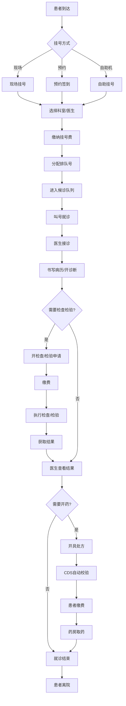

# M01 门诊管理子系统 - 产品需求文档(PRD)

> **文档编号**: YUDAO-HIS-PRD-M01
> **版本**: V1.0
> **创建日期**: 2026-06-16
> **所属系统**: YUDAO-AI-HIS智慧医疗信息系统
> **子系统优先级**: P0 (MVP必需)
> **参考文档**: YUDAO-HIS-PRD-001, YUDAO-HIS-FML-001, YUDAO-HIS-BPF-001, YUDAO-HIS-DD-001

---

## 1. 子系统概述

### 1.1 子系统定位

门诊管理子系统是YUDAO-AI-HIS的核心业务模块之一，覆盖患者从挂号、就诊、缴费到取药的完整门诊流程。系统支持现场挂号、预约挂号、医保挂号等多种挂号方式，提供门诊医生工作站实现电子处方和临床决策支持(CDS)，实现门诊收费和医保实时结算，支撑门诊药房的处方审核和发药管理。

### 1.2 业务目标

| 目标类型 | 目标描述 | 衡量指标 |
|----------|----------|----------|
| 效率目标 | 缩短患者就诊等待时间 | 平均就诊时间≤30分钟 |
| 安全目标 | 实现处方CDS自动校验 | CDS校验覆盖率100% |
| 便捷目标 | 支持多种挂号和支付方式 | 线上挂号占比≥50% |
| 合规目标 | 符合医保结算规范 | 医保实时结算成功率≥98% |

### 1.3 功能范围

```
M01 门诊管理
├── M01-01 挂号管理
│   ├── 现场挂号（窗口挂号）
│   ├── 预约挂号（微信/APP/网站）
│   ├── 分诊排队管理
│   ├── 退号处理
│   ├── 号源管理（排班、号池、加号）
│   ├── 医保挂号
│   ├── 自助挂号（自助机）
│   └── 急诊挂号（分级分诊）
├── M01-02 门诊医生工作站
│   ├── 患者接诊
│   ├── 患者信息查看（基本信息、就诊历史、过敏史）
│   ├── 诊断开立（ICD-10编码）
│   ├── 西药处方开立
│   ├── 中药处方开立
│   ├── 检查申请（影像、超声、内镜）
│   ├── 检验申请（含组合套餐）
│   ├── 门诊病历书写
│   ├── 处方审核(CDS) - 药物相互作用、过敏、剂量
│   ├── 病历模板管理
│   ├── 会诊申请
│   ├── 转诊处理
│   ├── 治疗申请
│   ├── 诊断证明开具
│   └── 知情同意签署
├── M01-03 门诊收费管理
│   ├── 门诊收费（费用汇总）
│   ├── 医保结算（实时对接）
│   ├── 退费处理（审批流程）
│   ├── 发票管理（电子发票、打印）
│   ├── 收费日报（日结对账）
│   ├── 费用查询
│   └── 收费项目维护
├── M01-04 门诊药房管理
│   ├── 处方接收
│   ├── 处方审核（合理性审核）
│   ├── 调配发药
│   ├── 退药处理
│   ├── 用药指导（打印用药指导单）
│   ├── 药房库存管理
│   └── 麻精药品管理
└── M01-05 门诊输液管理
    ├── 输液登记
    ├── 输液执行
    ├── 输液叫号
    └── 输液结束
```

### 1.4 用户角色

| 角色 | 主要职责 | 使用功能 |
|------|----------|----------|
| 收费员 | 挂号、收费、退费 | 挂号管理、收费管理 |
| 门诊医生 | 接诊、开方、病历 | 医生工作站 |
| 药剂师 | 处方审核、发药 | 药房管理 |
| 输液护士 | 输液执行 | 输液管理 |
| 患者 | 预约挂号、缴费 | 患者门户（微信/APP） |

### 1.5 依赖关系

**上游依赖**:
- M09 系统管理：用户、角色、权限、数据字典

**下游影响**:
- M04 检验管理：检验申请
- M05 影像管理：检查申请
- M06 药品管理：处方、药品库存

---

## 2. 功能模块详细设计

### 2.1 M01-01 挂号管理

#### 2.1.1 功能概述

挂号管理模块支持多种挂号方式，实现患者挂号登记、号源管理、分诊排队、退号处理等功能。

#### 2.1.2 挂号流程

```
患者到达
    │
    ├── 线上预约 ──→ 预约签到 ──┐
    │                          │
    ├── 现场挂号 ──→ 选择科室 ──┼──→ 分配排队号 ──→ 候诊 ──→ 就诊
    │                          │
    └── 自助挂号 ──→ 缴费打印 ─┘
```

#### 2.1.3 页面设计 - 现场挂号

```
页面布局：
┌─────────────────────────────────────────────────────────────┐
│ 现场挂号                                                     │
├─────────────────────────────────────────────────────────────┤
│ 患者信息                                                     │
│ ┌─────────────────────────────────────────────────────────┐ │
│ │ 身份证号: [读取身份证] [手动输入]                         │ │
│ │ 患者编号: [__________] [查询]                            │ │
│ │                                                         │ │
│ │ 姓名: 张三          性别: 男          年龄: 35岁        │ │
│ │ 手机: 138****0000   医保类型: 城镇职工                   │ │
│ │ 过敏史: 青霉素过敏                                       │ │
│ └─────────────────────────────────────────────────────────┘ │
│                                                              │
│ 挂号信息                                                     │
│ ┌─────────────────────────────────────────────────────────┐ │
│ │ 挂号日期: [2026-06-16] （今日）                          │ │
│ │ 科室:     [内科        ▼]                                │ │
│ │ 医生:     [李主任-专家  ▼] （专家号 剩余10号）           │ │
│ │ 挂号类型: [专家         ▼]                                │ │
│ │                                                         │ │
│ │ 挂号费:   50.00 元                                       │ │
│ │ 医保报销: 0.00 元（医保类型不支持）                       │ │
│ │ 个人支付: 50.00 元                                       │ │
│ └─────────────────────────────────────────────────────────┘ │
│                                                              │
│ 支付方式                                                     │
│ ┌──────┐ ┌──────┐ ┌──────┐ ┌──────┐                        │
│ │ 现金 │ │ 医保 │ │ 微信 │ │ 支付宝│                        │
│ └──────┘ └──────┘ └──────┘ └──────┘                        │
│                                                              │
│                              [确认挂号] [取消] [打印挂号单]  │
└─────────────────────────────────────────────────────────────┘
```

#### 2.1.4 字段定义 - 挂号记录

| 字段名 | 字段类型 | 必填 | 说明 |
|--------|----------|------|------|
| register_id | BIGINT | 是 | 挂号ID（主键） |
| register_no | VARCHAR(30) | 是 | 挂号编号 |
| patient_id | BIGINT | 是 | 患者ID |
| patient_name | VARCHAR(50) | 是 | 患者姓名 |
| patient_phone | VARCHAR(20) | 否 | 患者手机号 |
| register_date | DATE | 是 | 挂号日期 |
| dept_id | BIGINT | 是 | 挂号科室ID |
| dept_name | VARCHAR(100) | 是 | 科室名称 |
| doctor_id | BIGINT | 是 | 挂号医生ID |
| doctor_name | VARCHAR(50) | 是 | 医生姓名 |
| schedule_id | BIGINT | 是 | 排班ID |
| register_type | TINYINT | 是 | 挂号类型：1普通/2专家/3急诊 |
| queue_no | INT | 是 | 排队序号 |
| register_fee | DECIMAL(10,2) | 是 | 挂号费 |
| insurance_pay | DECIMAL(10,2) | 否 | 医保支付 |
| personal_pay | DECIMAL(10,2) | 是 | 个人支付 |
| pay_type | TINYINT | 是 | 支付方式：1现金/2医保/3微信/4支付宝/5银行卡 |
| pay_time | DATETIME | 否 | 支付时间 |
| register_status | TINYINT | 是 | 状态：1已挂号/2已就诊/3已退号/4已取消 |
| visit_time | DATETIME | 否 | 就诊时间 |
| is_appointment | TINYINT | 是 | 是否预约：0现场/1预约 |
| create_time | DATETIME | 是 | 创建时间 |
| create_by | VARCHAR(50) | 是 | 创建人 |

#### 2.1.5 接口设计

##### 挂号接口

```
接口路径: POST /api/op/register
请求体:
{
  "patientId": 1001,
  "registerDate": "2026-06-16",
  "deptId": 10,
  "doctorId": 100,
  "scheduleId": 50,
  "registerType": 2,
  "payType": 3
}

响应格式:
{
  "code": 200,
  "msg": "挂号成功",
  "data": {
    "registerId": 10001,
    "registerNo": "GH202606160001",
    "queueNo": 15,
    "registerFee": 50.00,
    "personalPay": 50.00
  }
}
```

##### 预约挂号接口

```
接口路径: POST /api/op/appointment
请求体:
{
  "patientId": 1001,
  "appointmentDate": "2026-06-20",
  "timeSlot": "09:00-09:30",
  "deptId": 10,
  "doctorId": 100,
  "registerType": 2
}
```

##### 退号接口

```
接口路径: POST /api/op/register/cancel/{registerId}
响应格式:
{
  "code": 200,
  "msg": "退号成功",
  "data": {
    "refundAmount": 50.00
  }
}
```

---

### 2.2 M01-02 门诊医生工作站

#### 2.2.1 功能概述

门诊医生工作站为门诊医生提供接诊、诊断、开方、检查检验申请、病历书写等核心功能。集成CDS临床决策支持系统，实现处方开立时的药物相互作用、过敏、剂量合理性自动校验。

#### 2.2.2 页面设计 - 医生工作站主界面

```
页面布局：
┌─────────────────────────────────────────────────────────────┐
│ 门诊医生工作站                              医生: 李主任    │
├────────────┬────────────────────────────────────────────────┤
│ 候诊列表   │ 患者信息                                      │
│ ┌────────┐│ ┌──────────────────────────────────────────┐  │
│ │排队号  ││ │ 姓名: 张三  性别: 男  年龄: 35岁         │  │
│ │ N001   ││ │ 患者编号: P202606160001                  │  │
│ │ 张三   ││ │ 就诊卡号: 12345678                       │  │
│ │ 内科   ││ │ 医保类型: 城镇职工                        │  │
│ │ [接诊] ││ │                                          │  │
│ ├────────┤│ │ 过敏史: 青霉素过敏 ⚠️                    │  │
│ │ N002   ││ │ 既往史: 高血压病史5年                     │  │
│ │ 李四   ││ │                                          │  │
│ │ 内科   ││ │ 本次就诊                                  │  │
│ │ [接诊] ││ │ 主诉: 发热、咳嗽3天                       │  │
│ ├────────┤│ │ 现病史: 患者3天前出现发热，体温最高38.5℃  │  │
│ │ N003   ││ │        伴咳嗽、咳痰，无胸闷气促...        │  │
│ │ 王五   ││ └──────────────────────────────────────────┘  │
│ │ 内科   ││                                               │
│ │ [接诊] ││ 诊断                    处方                   │
│ └────────┘│ ┌─────────────────┐ ┌─────────────────────┐  │
│            │ │ 主诊断:         │ │ 药品列表:           │  │
│            │ │ [J00 急性上呼吸道│ │ 1. 阿莫西林胶囊     │  │
│            │ │     感染    ▼]  │ │    0.5g×24粒       │  │
│            │ │                 │ │    口服 每日三次    │  │
│            │ │ 次诊断:         │ │    ⚠️ 过敏警告      │  │
│            │ │ [           ▼]  │ │                     │  │
│            │ │                 │ │ 2. 布洛芬缓释胶囊   │  │
│            │ │ [+添加诊断]     │ │    0.3g×20粒       │  │
│            │ └─────────────────┘ │    口服 每日两次    │  │
│            │                     │                     │  │
│            │                     │ 处方金额: 45.80元   │  │
│            │                     │                     │  │
│            │                     │ [+添加药品] [模板]  │  │
│            │                     └─────────────────────┘  │
│            │                                               │
│            │ [检查申请] [检验申请] [病历] [诊断证明]       │
│            │                                               │
│            │ [保存] [提交] [打印] [呼叫下一位]             │
└────────────┴────────────────────────────────────────────────┘
```

#### 2.2.3 CDS临床决策支持

CDS系统在处方开立时自动进行四维校验：

| 校验维度 | 校验内容 | 警告级别 |
|----------|----------|----------|
| 药物相互作用 | 药物-药物相互作用检查 | 高/中/低 |
| 过敏检查 | 基于患者过敏史的药物过敏检查 | 高 |
| 剂量合理性 | 基于年龄/体重/肾功能的剂量检查 | 中 |
| 配伍禁忌 | 静脉用药配伍禁忌检查 | 高 |

**CDS校验流程**：
```
医生添加药品
    │
    ↓
检查药物相互作用 ──→ 有相互作用 ──→ 显示警告（风险等级、机制、建议）
    │
    ↓ 无
检查过敏史 ──→ 存在过敏 ──→ 显示警告（过敏原、风险）
    │
    ↓ 无
检查剂量合理性 ──→ 剂量异常 ──→ 显示提示（推荐剂量范围）
    │
    ↓ 无
校验通过 ──→ 允许添加
```

#### 2.2.4 处方字段定义

| 字段名 | 字段类型 | 必填 | 说明 |
|--------|----------|------|------|
| prescription_id | BIGINT | 是 | 处方ID（主键） |
| prescription_no | VARCHAR(30) | 是 | 处方编号 |
| encounter_id | BIGINT | 是 | 就诊ID |
| patient_id | BIGINT | 是 | 患者ID |
| prescription_type | TINYINT | 是 | 处方类型：1普通/2急诊/3儿科/4麻醉/5精神/6中药 |
| dept_id | BIGINT | 是 | 开方科室 |
| doctor_id | BIGINT | 是 | 开方医生 |
| diagnose_code | VARCHAR(20) | 否 | 诊断编码（ICD-10） |
| diagnose_name | VARCHAR(100) | 否 | 诊断名称 |
| total_amount | DECIMAL(12,2) | 否 | 处方总金额 |
| pharmacist_id | BIGINT | 否 | 审方药师 |
| audit_time | DATETIME | 否 | 审方时间 |
| audit_result | TINYINT | 否 | 审方结果：1通过/2退回 |
| prescription_status | TINYINT | 是 | 状态：1开立/2审核通过/3审核退回/4已调配/5已发药/6已退药 |
| create_time | DATETIME | 是 | 创建时间 |

#### 2.2.5 接口设计

##### 开立处方接口

```
接口路径: POST /api/op/prescription
请求体:
{
  "encounterId": 1001,
  "patientId": 100,
  "prescriptionType": 1,
  "diagnoseCode": "J00",
  "diagnoseName": "急性上呼吸道感染",
  "items": [
    {
      "drugId": 1001,
      "drugCode": "AMXL001",
      "drugName": "阿莫西林胶囊",
      "drugSpec": "0.5g×24粒",
      "dosage": 0.5,
      "dosageUnit": "g",
      "frequencyCode": "TID",
      "frequencyName": "每日三次",
      "routeCode": "PO",
      "routeName": "口服",
      "quantity": 24,
      "unit": "粒",
      "days": 3
    }
  ]
}

响应格式:
{
  "code": 200,
  "msg": "处方开立成功",
  "data": {
    "prescriptionId": 10001,
    "prescriptionNo": "RX202606160001",
    "cdsWarnings": [
      {
        "type": "ALLERGY",
        "level": "HIGH",
        "message": "患者对青霉素过敏，阿莫西林属于青霉素类药物",
        "suggestion": "建议更换为其他类别抗生素"
      }
    ]
  }
}
```

---

### 2.3 M01-03 门诊收费管理

#### 2.3.1 功能概述

门诊收费管理模块实现门诊费用自动汇总、医保实时结算、多种支付方式、退费处理、发票管理、收费日报等功能。

#### 2.3.2 页面设计 - 门诊收费

```
页面布局：
┌─────────────────────────────────────────────────────────────┐
│ 门诊收费                                                     │
├─────────────────────────────────────────────────────────────┤
│ 患者信息                                                     │
│ 就诊卡号/患者编号: [__________] [查询]                       │
│ 姓名: 张三    性别: 男    医保类型: 城镇职工                 │
├─────────────────────────────────────────────────────────────┤
│ 待收费项目                                                   │
│ ┌────┬────────────┬──────┬──────┬────────┬────────┐        │
│ │选择│项目名称    │单价  │数量  │金额    │类型    │        │
│ ├────┼────────────┼──────┼──────┼────────┼────────┤        │
│ │ ☑ │挂号费      │50.00 │ 1    │ 50.00  │挂号费  │        │
│ │ ☑ │诊查费      │20.00 │ 1    │ 20.00  │诊查费  │        │
│ │ ☑ │阿莫西林胶囊│ 2.00 │ 24   │ 48.00  │药品费  │        │
│ │ ☑ │布洛芬缓释胶囊│35.00│ 1   │ 35.00  │药品费  │        │
│ │ ☑ │血常规      │25.00 │ 1    │ 25.00  │化验费  │        │
│ └────┴────────────┴──────┴──────┴────────┴────────┘        │
│                                                              │
│ 费用汇总                                                     │
│ ┌─────────────────────────────────────────────────────────┐ │
│ │ 项目          │ 金额      │ 医保报销 │ 个人自付         │ │
│ │ 挂号费        │  50.00   │   0.00  │  50.00          │ │
│ │ 诊查费        │  20.00   │  15.00  │   5.00          │ │
│ │ 药品费        │  83.00   │  60.00  │  23.00          │ │
│ │ 化验费        │  25.00   │  20.00  │   5.00          │ │
│ │ ─────────────┼──────────┼─────────┼─────────────────│ │
│ │ 合计          │ 178.00   │  95.00  │  83.00          │ │
│ └─────────────────────────────────────────────────────────┘ │
│                                                              │
│ 支付方式                                                     │
│ ┌──────┐ ┌──────┐ ┌──────┐ ┌──────┐                        │
│ │ 现金 │ │ 医保 │ │ 微信 │ │ 支付宝│                        │
│ └──────┘ └──────┘ └──────┘ └──────┘                        │
│                                                              │
│                              [确认收费] [打印发票] [取消]    │
└─────────────────────────────────────────────────────────────┘
```

#### 2.3.3 医保结算流程

```
费用汇总
    │
    ↓
判断是否医保患者 ──→ 否 ──→ 全额自费
    │
    ↓ 是
医保预结算（调用医保接口）
    │
    ↓
医保目录对照
    │
    ├── 甲类药品 ──→ 全额纳入报销
    ├── 乙类药品 ──→ 部分纳入报销（自付比例）
    └── 丙类药品 ──→ 全额自费
    │
    ↓
计算报销金额
    │
    ↓
计算个人自付
    │
    ↓
收费确认
```

---

### 2.4 M01-04 门诊药房管理

#### 2.4.1 功能概述

门诊药房管理模块实现处方接收、审核、调配、发药的全流程管理。支持麻精药品专项管理，自动扣减库存，打印用药指导单。

#### 2.4.2 页面设计 - 处方审核发药

```
页面布局：
┌─────────────────────────────────────────────────────────────┐
│ 门诊药房 - 处方审核发药                                      │
├────────────┬────────────────────────────────────────────────┤
│ 待处理处方 │ 处方详情                                      │
│ ┌────────┐│ ┌──────────────────────────────────────────┐  │
│ │处方编号││ │ 处方编号: RX202606160001                  │  │
│ │RX0001  ││ │ 患者: 张三  男  35岁                     │  │
│ │张三    ││ │ 诊断: 急性上呼吸道感染                    │  │
│ │内科    ││ │ 医生: 李主任  开方时间: 2026-06-16 10:30│  │
│ │[处理]  ││ │                                          │  │
│ ├────────┤│ │ 药品明细:                                │  │
│ │RX0002  ││ │ ┌────┬──────────┬──────┬────┬────┐      │  │
│ │李四    ││ │ │序号│药品名称  │规格  │数量│用法 │      │  │
│ │外科    ││ │ ├────┼──────────┼──────┼────┼─────┤      │  │
│ │[处理]  ││ │ │ 1  │阿莫西林胶囊│0.5g×24│ 24│口服TID│     │  │
│ ├────────┤│ │ │ 2  │布洛芬缓释│0.3g×20│ 20│口服BID│     │  │
│ │RX0003  ││ │ └────┴──────────┴──────┴────┴─────┘      │  │
│ │王五    ││ │                                          │  │
│ │儿科    ││ │ 审核状态: 已审核通过                      │  │
│ │[处理]  ││ │ 审方药师: 药师A                           │  │
│ └────────┘│ └──────────────────────────────────────────┘  │
│            │                                               │
│            │ 发药操作                                      │
│            │ ┌──────────────────────────────────────────┐  │
│            │ │ 确认患者姓名: [____________]              │  │
│            │ │ 确认就诊卡号: [____________]              │  │
│            │ │                                          │  │
│            │ │ [确认发药] [打印用药指导] [退回处方]      │  │
│            │ └──────────────────────────────────────────┘  │
└────────────┴────────────────────────────────────────────────┘
```

---

## 3. 业务流程

### 3.1 门诊就诊全流程



### 3.2 处方开立与CDS校验流程

```
医生开立处方
    │
    ↓
选择药品 ──→ 设置用法用量
    │
    ↓
CDS自动校验
    │
    ├── 药物相互作用检查 ──→ 有 ──→ 显示警告（风险等级+机制）
    │
    ├── 过敏史检查 ──→ 有过敏 ──→ 显示警告（过敏原+风险）
    │
    ├── 剂量合理性检查 ──→ 异常 ──→ 显示提示（推荐范围）
    │
    └── 配伍禁忌检查 ──→ 有 ──→ 显示警告（禁忌说明）
    │
    ↓
医生确认（继续/修改）
    │
    ↓
提交处方
    │
    ↓
处方状态: 开立
```

---

## 4. 非功能需求

### 4.1 性能需求

| 指标 | 要求 |
|------|------|
| 挂号响应时间 | ≤2秒 |
| 处方开立响应 | ≤2秒 |
| CDS校验时间 | ≤500ms |
| 收费响应时间 | ≤3秒（含医保结算） |
| 日门诊量支持 | ≥5000人次 |

### 4.2 安全需求

| 需求 | 标准 |
|------|------|
| CDS校验覆盖 | 100%处方必校验 |
| 过敏警告 | 高优先级警告不可忽略 |
| 医保结算 | 实时对接医保平台 |
| 审计日志 | 所有关键操作记录 |

---

## 5. 开发计划

### 5.1 Sprint规划

| Sprint | 内容 | 工期 |
|--------|------|------|
| Sprint 2 | 挂号管理（现场、预约、号源） | 2周 |
| Sprint 3 | 医生工作站（接诊、诊断、处方、CDS） | 3周 |
| Sprint 4 | 收费管理、药房管理 | 2周 |

---

> **编制**: YUDAO-AI-HIS产品组
> **最后更新**: 2026-06-16